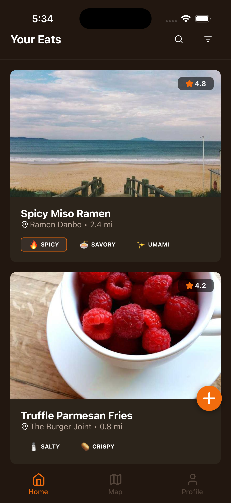
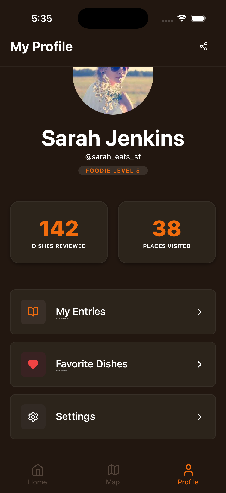
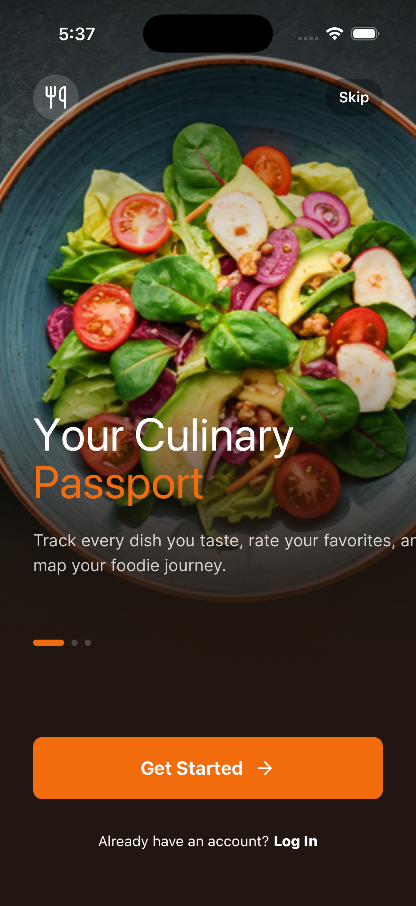

  
   
  

# YumLog

YumLog is a food discovery app that allows users to track their culinary adventures. Users can explore curated collections of the best hidden gems in their city, rate their favorite dishes, and connect with fellow foodies.

## Features

- Discover new flavors and hidden gems in your city
- Track every dish you taste and rate your favorites
- Connect with fellow foodies and share your latest culinary finds

## Installation

1. Clone the repository: `git clone https://github.com/your-username/YumLog.git`
2. Install dependencies: `npm install`
3. Start the app: `npm start`

## Usage

1. Open the app in your preferred development environment (e.g., Expo Go)
2. Sign up or log in to your account
3. Explore curated collections of the best hidden gems in your city
4. Track every dish you taste and rate your favorites
5. Connect with fellow foodies and share your latest culinary finds

## Contributing

We welcome contributions from the community! If you'd like to contribute to YumLog, please follow these steps:

1. Fork the repository
2. Create a new branch: `git checkout -b feature/your-feature`
3. Make your changes and commit them: `git commit -m 'Add feature XYZ'`
4. Push to the branch: `git push origin feature/your-feature`
5. Open a pull request

## License

YumLog is licensed under the MIT License. See the [LICENSE](LICENSE) file for more information.

## Acknowledgements

- [Expo](https://expo.dev/) for providing the development environment
- [Tamagui](https://tamagui.dev/) for the UI components
- [Picsum](https://picsum.photos/) for the placeholder images
