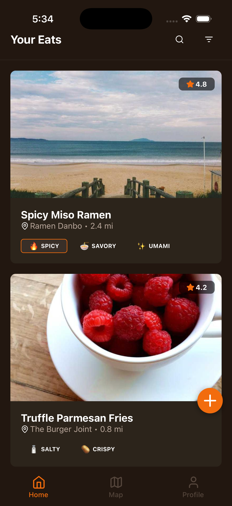
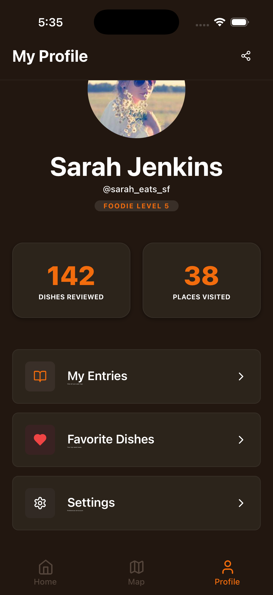
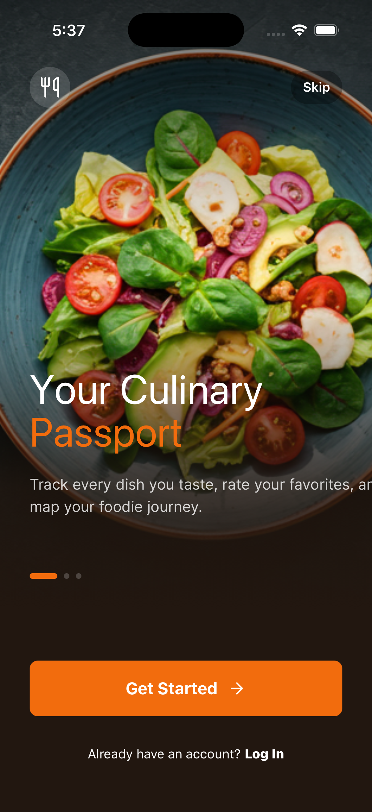

  
   
  

# YumLog 🍽️

A React Native food logging and discovery app built with Expo, Firebase, and Tamagui. Log your favorite meals, discover restaurants on a map, and build your culinary journey.

---

## 📋 Project Overview

YumLog is a mobile-first application that allows users to:
- Authenticate securely with email/password or Google Sign-In
- Log food items with details
- Browse food entries and details
- Discover restaurants and food locations on a map
- Manage their profile and preferences

**Tech Stack**:
- **Frontend**: React Native (Expo)
- **UI Framework**: Tamagui
- **Backend**: Firebase (Auth, Firestore)
- **State Management**: Zustand (via `useAuth` store)
- **Forms**: React Hook Form + Zod
- **HTTP Client**: TanStack React Query
- **Routing**: Expo Router (file-based routing)